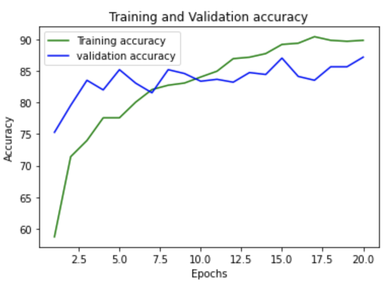

# DeepFake Tespit Web Uygulaması

[](https://opensource.org/licenses/MIT)
[](https://www.python.org/)
[](https://flask.palletsprojects.com/)
[](https://pytorch.org/)

Bu proje, yüklenen videoların **gerçek (Real)** mi yoksa **sahte (Fake)** mi olduğunu tespit etmek için derin öğrenme modeli kullanan, web tabanlı bir DeepFake analiz sistemidir. Modern ve kullanıcı dostu arayüzü sayesinde, videoları sürükle-bırak yöntemiyle kolayca analiz edebilirsiniz.

Proje, temel model altyapısı olarak [Daxitdon/DeepFake-Detection](https://github.com/Daxitdon/DeepFake-Detection) reposunu kullanır ve bu modeli bir Flask sunucusu üzerinden erişilebilir hale getirir.

<br>

## 🚀 Projenin Öne Çıkan Özellikleri

- **Modern Web Arayüzü:** Temiz, duyarlı ve sürükle-bırak destekli dosya yükleme alanı.
- **Güçlü Backend:** Python ve Flask ile oluşturulmuş, video işleme ve model çıkarımını yöneten bir sunucu.
- **Derin Öğrenme Modeli:** Görüntü sınıflandırmada başarısı kanıtlanmış, önceden eğitilmiş bir **ResNeXt50** modeli kullanır.
- **Kare Bazlı Analiz:** Videoyu karelere ayırır ve her bir kare için ayrı bir tahmin yaparak genel bir güven skoru hesaplar.
- **Otomatik Donanım Tespiti:** Sunucunun çalıştığı sistemde GPU (CUDA) varsa otomatik olarak kullanarak analiz sürecini hızlandırır, yoksa CPU üzerinden devam eder.
- **Kolay Kurulum:** `requirements.txt` dosyası sayesinde bağımlılıkların hızlıca kurulmasını sağlar.

<br>

## 🛠️ Kullanılan Teknolojiler

- **Backend:** Python, Flask, PyTorch, TorchVision, OpenCV, NumPy
- **Frontend:** HTML5, CSS3, JavaScript
- **Model:** ResNeXt50-32x4d

<br>

## ⚙️ Nasıl Çalışır?

Uygulamanın çalışma mantığı aşağıdaki adımlardan oluşur:

1.  **Video Yükleme:** Kullanıcı, web arayüzü üzerinden bir video dosyası seçer veya sürükleyip bırakır.
2.  **Sunucuya Gönderme:** Video, Flask sunucusundaki `/Detect` endpoint'ine gönderilir.
3.  **Video İşleme:** Sunucu, [OpenCV](https://opencv.org/) kütüphanesini kullanarak videodan belirli sayıda (bu projede 20) kare yakalar.
4.  **Veri Ön İşleme:** Her bir kare, modelin beklediği formata (boyutlandırma, normalizasyon vb.) getirilir.
5.  **Tahmin:** Ön işlenmiş kareler, PyTorch ile yüklenen ResNeXt50 modeline tek tek verilir. Model, her karenin "Fake" ve "Real" olma olasılıklarını hesaplar.
6.  **Sonuç Hesaplama:** Tüm karelerden elde edilen olasılıkların ortalaması alınarak videonun genel sonucu (`FAKE` veya `REAL`) ve güven yüzdesi (`Confidence`) belirlenir.
7.  **Arayüze Gönderme:** Hesaplanan sonuç, JSON formatında web arayüzüne geri gönderilir ve kullanıcıya gösterilir.
8.  **Temizlik:** Analiz bittikten sonra yüklenen video dosyası sunucudan otomatik olarak silinir.

<br>

## 📊 Model Performansı

Model, %87'nin üzerinde bir doğruluk oranına sahiptir. Eğitim sürecindeki performans metrikleri aşağıda görselleştirilmiştir.

| Confusion Matrix                                     | Eğitim ve Doğrulama Kaybı (Loss)                             | Eğitim ve Doğrulama Başarısı (Accuracy)                        |
| ---------------------------------------------------- | ------------------------------------------------------------ | -------------------------------------------------------------- |
|  |  |  |

**Hesaplanan Doğruluk (Accuracy):** **%87.17**

<br>

## 🚀 Başlarken

Bu projeyi yerel makinenizde çalıştırmak için aşağıdaki adımları izleyin.

### Ön Gereksinimler

- [Python 3.7+](https://www.python.org/downloads/)
- `pip` (Python paket yöneticisi)

### Kurulum Adımları

1.  **Projeyi Klonlayın:**
    ```bash
    git clone [https://github.com/KULLANICI-ADINIZ/PROJE-ADINIZ.git](https://github.com/KULLANICI-ADINIZ/PROJE-ADINIZ.git)
    cd PROJE-ADINIZ
    ```

2.  **Sanal Ortam Oluşturun ve Aktifleştirin:**
    *Bu, proje bağımlılıklarını sisteminizden izole etmenizi sağlar.*
    ```bash
    # Sanal ortamı oluştur
    python -m venv venv

    # Windows için aktifleştirme
    .\venv\Scripts\activate

    # macOS/Linux için aktifleştirme
    source venv/bin/activate
    ```

3.  **Gerekli Kütüphaneleri Yükleyin:**
    ```bash
    pip install -r requirements.txt
    ```

4.  **Önceden Eğitilmiş Modeli İndirin:**
    Bu proje, çalışmak için bir model dosyasına ihtiyaç duyar.
    - Model dosyasını (`df_model.pt`) [Daxitdon/DeepFake-Detection](https://github.com/Daxitdon/DeepFake-Detection) reposundan veya uygun bir kaynaktan indirin.
    - Proje ana dizininde `model` adında bir klasör oluşturun.
    - İndirdiğiniz `df_model.pt` dosyasını bu klasörün içine taşıyın.

    Proje yapınız şu şekilde görünmelidir:
    ```
    .
    └── model/
        └── df_model.pt
    ```

5.  **Uygulamayı Başlatın:**
    ```bash
    python server.py
    ```
    Uygulama başlatıldığında terminalde aşağıdaki gibi bir çıktı göreceksiniz:
    ```
    Uygulama başlatılıyor — Cihaz: cuda  (veya cpu)
     * Running on [http://127.0.0.1:5000](http://127.0.0.1:5000)
    ```

6.  **Tarayıcıda Açın:**
    Web tarayıcınızı açın ve `http://127.0.0.1:5000` adresine gidin.

<br>

## 📂 Proje Yapısı
